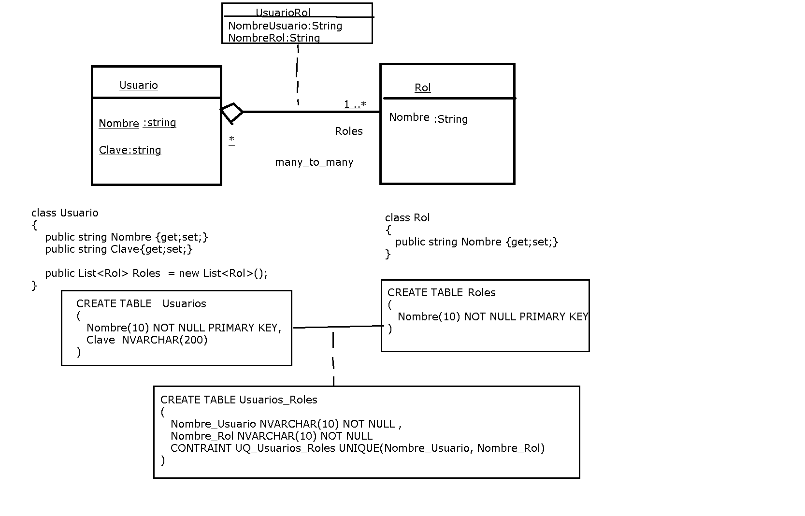


## paquetes NuGet

Swagger: `Swashbuckle.AspNetCore`

ADO.NET: `Microsoft.Data.SqlClient`

 
## Modelo de estudio



## Configuración del Startup (Program.cs)

### Configuración de cómo se manejan la autenticación (con cookies) y la sesión (tiempo, cookies esenciales, etc.).

 Configura el sistema de autenticación para usar el esquema de Cookies. "Cookies" es el nombre del esquema de autenticación que será utilizado por el sistema para identificar a los usuarios autenticados.

```csharp
builder.Services.AddAuthentication("Cookies")
    .AddCookie(options =>
    {
        options.LoginPath = "/Account/Login";
        options.LogoutPath = "/Account/Logout";
    });
```

### Habilita los servicios de autorización.

Es necesarios para aplicar restricciones de acceso basadas en políticas o roles.

```csharp
builder.Services.AddAuthorization();
```

### Configura el sistema de manejo de sesiones

- IdleTimeout: Tiempo de inactividad permitido antes de que la sesión expire. En este caso, 30 minutos.
- Cookie.HttpOnly: Indica que las cookies de la sesión no pueden ser accedidas mediante JavaScript, mejorando la seguridad.
- Cookie.IsEssential: Indica que la cookie de sesión es esencial para el funcionamiento del sitio, lo que asegura que se establecerá incluso si el usuario ha deshabilitado las cookies no esenciales.

```csharp
builder.Services.AddSession(options =>
{
    options.IdleTimeout = TimeSpan.FromMinutes(30); 
    options.Cookie.HttpOnly = true; 
    options.Cookie.IsEssential = true; 
});
```

#### Inclusión el middleware necesario para aplicar estas configuraciones

Además se asegura de que las solicitudes del usuario sean verificadas (autenticación/autorización) y tambien que puedan manejar datos de sesión.

- Se añade el middleware de autorización al pipeline de solicitudes.
- Este middleware verifica si el usuario tiene permiso para acceder al recurso solicitado. Funciona junto con la autenticación para validar los permisos del usuario autenticado.

```csharp
app.UseAuthorization();
```

### Habilita el uso de sesiones en la aplicación.

Este middleware asegura que las solicitudes posteriores del cliente puedan acceder a los datos almacenados en la sesión. Por ejemplo, al usar HttpContext.Session para guardar o recuperar datos temporales relacionados con un usuario.

```
app.UseSession();
```

## Ejemplo de controlador del Login

```csharp
using Ejemplo_04_CRUD_REST_Login.Models;
using Ejemplo_04_CRUD_REST_Login.Services;
using Microsoft.AspNetCore.Authentication;
using Microsoft.AspNetCore.Authorization;
using Microsoft.AspNetCore.Mvc;
using System.Security.Claims;

namespace Ejemplo_04_CRUD_REST_Login.Controllers;

[Authorize]
public class AccountController : Controller
{
    UsuariosService _service = new UsuariosService();

    [AllowAnonymous]
    async public Task<ViewResult> Login(string ReturnUrl)
    {
        return View(new UsuarioModel
        {
            ReturnUrl = ReturnUrl
        });
    }

    [HttpPost]
    [AllowAnonymous]
    [ValidateAntiForgeryToken]
    public async Task<IActionResult> Login(UsuarioModel usuario, string returnUrl = "/")

        var result = _service.VerificarLogin(usuario);

        if (usuario == null)
        {
            ModelState.AddModelError("", "Usuario o contraseña no válidos.");
            return View();
        }
      
        var claims = new List<Claim>()
        {
             new Claim(ClaimTypes.Name, usuario.Nombre),
        };

        var identity = new ClaimsIdentity(claims, "Cookies");
        var principal = new ClaimsPrincipal(identity);

        await HttpContext.SignInAsync("Cookies", principal);

        return Redirect(returnUrl);
    }

    public async Task<RedirectResult> Logout(string returnUrl = "/")
    {
        await HttpContext.SignOutAsync();
        return Redirect(returnUrl);
    }
}
```

## Vista asociada al controlador

```html
@model Ejemplo_04_CRUD_REST_Login.Models.UsuarioModel

@{
    ViewBag.Title = "Log In";
    Layout = "_AdminLayout";
}

<div class="container">

    <div class="text-danger" asp-validation-summary="All"></div>

    <div class="row">

        <form asp-action="Login" asp-controller="Account" method="post">

            <input type="hidden" asp-for="ReturnUrl" />

            <div class="form-group">
                <label asp-for="Nombre"></label>
                <div><span asp-validation-for="Nombre" class="text-danger"></span></div>
                <input asp-for="Nombre" class="form-control" />
            </div>

            <div class="form-group">
                <label asp-for="Clave"></label>
                <div><span asp-validation-for="Clave" class="text-danger"></span></div>
                <input asp-for="Clave" class="form-control" />
            </div>

            <button class="btn btn-primary" type="submit">Log In</button>
        </form>

    </div>
</div>

```

## Ejemplo de controlador que requirará autentificación

```csharp
using Ejemplo_04_CRUD_REST_Login.Services;
using Ejemplo_04_CRUD_REST_Login.Models;
using Microsoft.AspNetCore.Authorization;
using Microsoft.AspNetCore.Mvc;

namespace Ejemplo_04_CRUD_REST_Login.Controllers;

[Authorize]
public class PersonasController : Controller
{
    private PersonasService servicio = new PersonasService();

    // GET: PersonasController
    [HttpGet]
    public IActionResult Index()
    {
        return View(servicio.GetAll());
    }

    // GET: PruebaController1/Details/5
    [HttpGet]
    public ActionResult Details(int id)
    {
        var persona = servicio.GetById(id);
        return View(persona);
    }

    // GET: PruebaController1/Create
    [HttpGet]
    public ActionResult Create()
    {
        return View();
    }

    // POST: PruebaController1/Create
    [HttpPost]
    [ValidateAntiForgeryToken]
    //https://learn.microsoft.com/es-es/aspnet/core/security/anti-request-forgery?view=aspnetcore-9.0
    // http://go.microsoft.com/fwlink/?LinkId=317598
    public ActionResult Create(PersonaModel nuevo)
    {
        try
        {
            servicio.CrearNuevo(nuevo);
            return RedirectToAction(nameof(Index));
        }
        catch
        {
            return View();
        }
    }

    // GET: PersonaController1/Edit/5
    //http://localhost:5033/Personas/Editar/1
    [HttpGet]
    public IActionResult Edit(int? id)
    {
        if (id == null)
            return BadRequest();

        var persona = servicio.GetById(Convert.ToInt32(id));
        return View(persona);
    }

    // POST: PersonaController/Edit/1
    [HttpPost]
    [ValidateAntiForgeryToken]
    public ActionResult Edit(int id, PersonaModel persona)
    {
        if (id != persona.Id)
            return NotFound();

        if (ModelState.IsValid)
        {
            try
            {
                servicio.Actualizar(persona);
            }
            catch (Exception ex)
            {
                ModelState.AddModelError("", "Error");
            }
            return RedirectToAction(nameof(Index));
        }
        return View(persona);
    }

    // GET: PruebaController1/Delete/5
    [HttpGet]
    public ActionResult Delete(int? id)
    {
        if (id == null || id <= 0)
            return BadRequest();

        var persona = servicio.GetById(Convert.ToInt32(id));

        if (persona == null)
            return NotFound();

        return View(persona);
    }

    // POST: PruebaController1/Delete/5
    [HttpPost]
    [ValidateAntiForgeryToken]
    public ActionResult Delete(int? id, PersonaModel persona)
    {
        if (id == null || id <= 0)
            return BadRequest();

        try
        {
            if (servicio.GetById(Convert.ToInt32(id)) == null)
                return NotFound();

            servicio.Eliminar(Convert.ToInt32(id));

            return RedirectToAction(nameof(Index));
        }
        catch
        {
            return RedirectToAction("Delete", new { id = id, saveChangesError = true });
        }
    }
}
```


 /*
    public string HashPassword(string input)
    {
        if (string.IsNullOrEmpty(input))
            throw new ArgumentNullException(nameof(input), "Input string cannot be null or empty");

        using var sha256 = SHA256.Create();

        byte[] inputBytes = Encoding.UTF8.GetBytes(input);
        byte[] hashBytes = sha256.ComputeHash(inputBytes);

        return BitConverter.ToString(hashBytes).Replace("-", "").ToUpper();

    }

    */