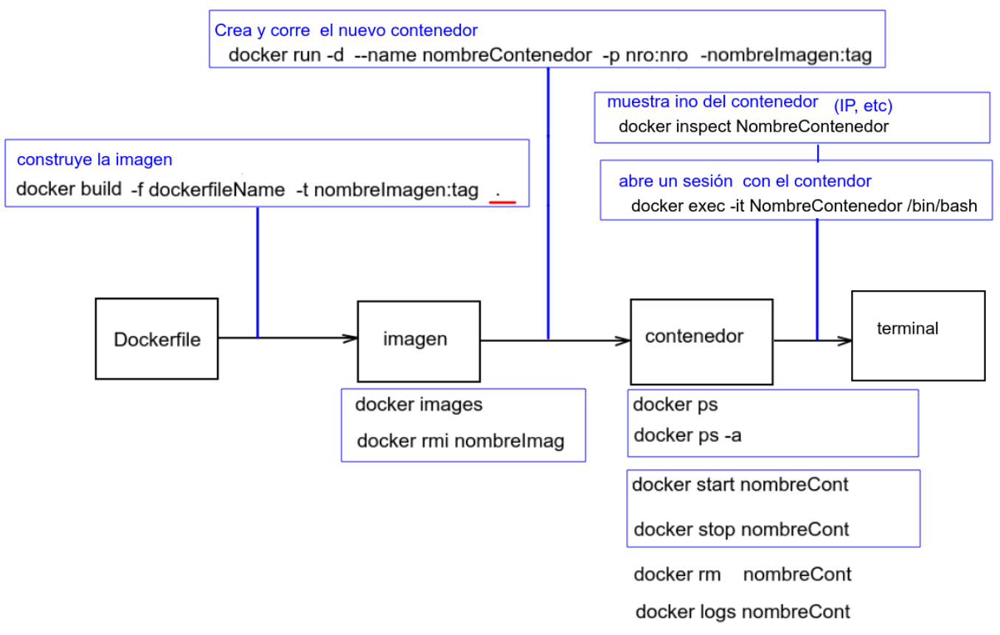

### Workflow




## instalar el servidor de tiempo

verificando la sincronizacion

```bash
ntpq -p
```

si el comando no está instalado

```bash
sudo apt install ntp -y
```

listar las zonas

```bash
timedatectl list-timezones
```

revisar la zona horaria

```bash
timedatectl
```

setear la zona horaria

```bash
sudo timedatectl set-timezone America/Argentina/Buenos_Aires
```

revisar el enlace simbólico que esté

```bash
ls /usr/share/zoneinfo/America/Argentina/Buenos_Aires
```

sino esta ese enlace simbólico, crearlo con

```bash
sudo ln -sf /usr/share/zoneinfo/America/Argentina/Buenos_Aires /etc/localtime
```

revisar el /etc/timezone

```bash
cat /etc/timezone
```

tiene que tener como conteneido algo como

```txt
America/Argentina/Buenos_Aires
```

sino hay contenido u otra cosa hacer

```bash
echo "America/Argentina/Buenos_Aires" | sudo tee /etc/timezone
```

restartear el servicio, algunos servicios lo pueden requerir

```bash
sudo service ntp restart
```

revisar con

```bash
timedatectl
```

```bash
date
```