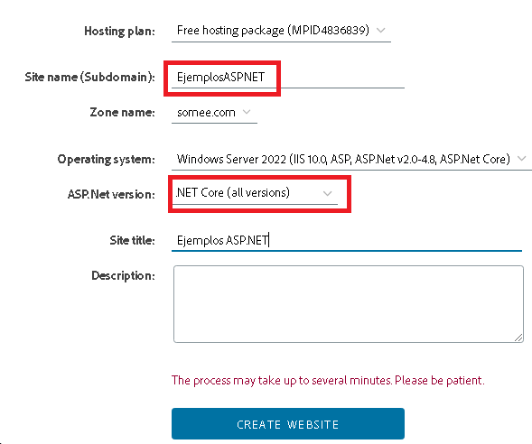

### Alta del sitio website



### Viendo los datos del sitio dado de alta

Necesitamos los datos del alta del sitio para publicar nuestra aplicación


### Publicando desde visualstudio


### Resumen del alta:

```
Servidor: ftp://EjemplosASPNET.somee.com

Carpeta destino en el servidor:  www.EjemplosASPNET.somee.com 
 
URL del sitio: EjemplosASPNET.somee.com
 
usuario:  fernando-dev

```

## Crear certificado https


